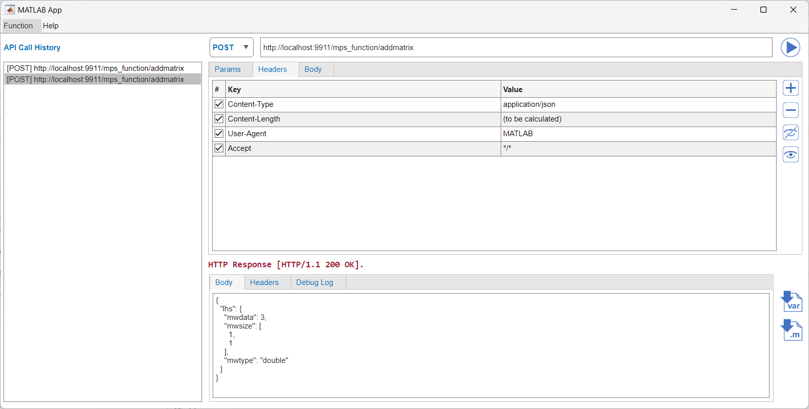

# API Tester for MATLAB

This GUI tool helps your REST API call workflow on MATLAB desktop.

You can
- Send REST API from your MATLAB to external service
- Import response data returned by REST API to your MATLAB workspace
- Generate MATLAB code (m file) for sending REST API programatically




## MATLAB Version
Developed and Tested on MATLAB R2023b.


## Install and Run as MATLAB App package
1. Go to package folder
2. Double-click ML_APITester.mlappinstall file.
3. You will see pop-up dialog, so proceed app installation.
4. From "Apps" tab on MATLAB Desktop, click "ML_APITester" icon


## Run from source code
Run following command from your MATLAB Command Window.

   ```appmain```


## License
The license is available in the LICENSE file in this GitHub repository.
